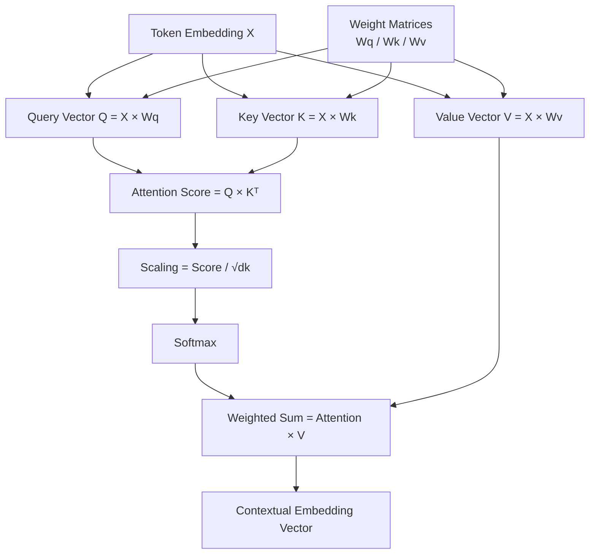

# Design and Verification of a Fixed-Point Attention Accelerator
## Overview

This project implements a hardware accelerator for the self-attention mechanism using **SystemVerilog** and **fixed-point arithmetic**.

The objective is to translate the mathematical operations of self-attention into synthesizable RTL and verify the hardware implementation against a Python reference mathematical model.

## Architecture


## Attention Pipeline

The accelerator implements the following pipeline:

Token Embedding → Q/K/V vectors → Attention Score → Scaling → Softmax → Attention Weight → Comtextual Embedding Vector as Output

The mathematical formulation is:

Q = X × Wq

K = X × Wk

V = X × Wv
Where,
* X --> Token Embedding of M*N dimention
* Wq,Wk,Wv--> Weight matrices or learning matrices of N*N dimention

Attention Score = Q × Kᵀ

Scaled Score = Score / √dk

Attention probabilities = Softmax(Scaled Score)

Contextual Embedding(Weighted Sum) = Attention probabilities × V


## Architecture

```mermaid
              Token Embedding X
                      │
          ┌───────────┼───────────┐
          ▼           ▼           ▼
        X × Wq      X × Wk      X × Wv
          │           │           │
          ▼           ▼           ▼
          Q           K           V
           \          /
            \        /
             ▼      ▼
             Q × Kᵀ
                │
                ▼
             Scaling
                │
                ▼
             Softmax
                │
                ▼
           Attention weight × V
                │
                ▼
          Output Embedding
